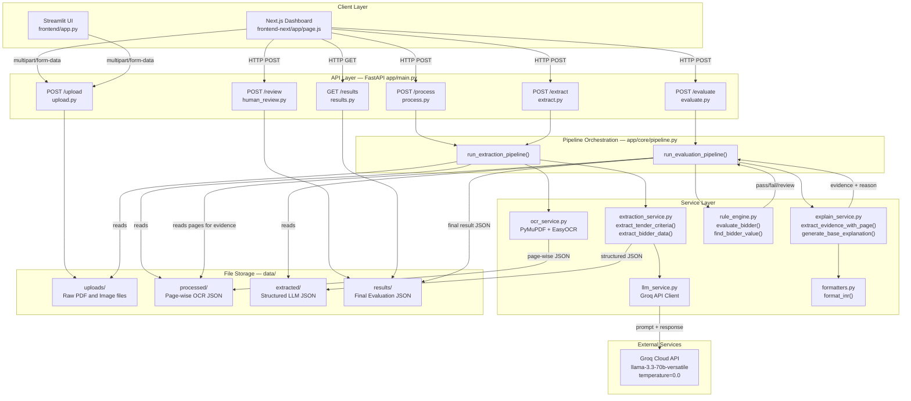

░█████╗░██╗  ████████╗███████╗███╗░░██╗██████╗░███████╗██████╗  ░██████╗██╗░░░██╗░██████╗████████╗███████╗███╗░░░███╗
██╔══██╗██║  ╚══██╔══╝██╔════╝████╗░██║██╔══██╗██╔════╝██╔══██╗ ██╔════╝╚██╗░██╔╝██╔════╝╚══██╔══╝██╔════╝████╗░████║
███████║██║  ░░░██║░░░█████╗░░██╔██╗██║██║░░██║█████╗░░██████╔╝ ╚█████╗░░╚████╔╝░╚█████╗░░░░██║░░░█████╗░░██╔████╔██║
██╔══██║██║  ░░░██║░░░██╔══╝░░██║╚████║██║░░██║██╔══╝░░██╔══██╗ ░╚═══██╗░░╚██╔╝░░░╚═══██╗░░░██║░░░██╔══╝░░██║╚██╔╝██║
██║░░██║██║  ░░░██║░░░███████╗██║░╚███║██████╔╝███████╗██║░░██║ ██████╔╝░░░██║░░░██████╔╝░░░██║░░░███████╗██║░╚═╝░██║
╚═╝░░╚═╝╚═╝  ░░░╚═╝░░░╚══════╝╚═╝░░╚══╝╚═════╝░╚══════╝╚═╝░░╚═╝ ╚═════╝░░░░╚═╝░░░╚═════╝░░░░╚═╝░░░╚══════╝╚═╝░░░░░╚═╝

# AI-Based Tender Evaluation System

A production-grade, end-to-end pipeline for automated government tender bid evaluation. The system ingests unstructured procurement documents, extracts structured eligibility criteria and bidder data using a large language model, evaluates compliance using a deterministic rule engine, locates evidence with exact page citations, and surfaces results to a human reviewer for final decision.

---

## Problem Statement

Government procurement requires evaluating bidder eligibility against a published tender's criteria — typically checking annual turnover, GST registration, completed project history, and other mandatory qualifications. This process is done manually today: a committee reads every submitted document, cross-checks values, and writes justifications. The process is slow (days per tender), inconsistent across evaluators, and difficult to audit.

This system automates the extraction, comparison, and evidence-gathering steps, reducing evaluation from days to under a minute, while keeping a human officer in the final decision loop.

---

## System Architecture

The pipeline is divided into five discrete, independently testable layers. Each layer produces a structured output that feeds the next. No layer has a circular dependency.



### Layer Responsibilities

| Layer | Files | Responsibility |
|-------|-------|----------------|
| Client | `frontend-next/`, `frontend/` | File upload, pipeline trigger, result display, human review |
| API | `app/routes/` | HTTP routing, request validation via Pydantic, response formatting |
| Pipeline | `app/core/pipeline.py` | Orchestrates service calls, reads/writes files, computes summary fields |
| Services | `app/services/` | Isolated business logic: OCR, LLM calls, rule evaluation, evidence search |
| Storage | `data/` | File-based persistence; one JSON file per document per stage |
| External | Groq API | LLM inference; used only in the extraction stage |


---

## Project Structure

```
AI-for-bharat/
├── app/
│   ├── main.py                    -- FastAPI application, CORS config, router registration
│   ├── core/
│   │   └── pipeline.py            -- Orchestration: extraction pipeline + evaluation pipeline
│   ├── routes/
│   │   ├── upload.py              -- POST /upload
│   │   ├── process.py             -- POST /process
│   │   ├── extract.py             -- POST /extract
│   │   ├── evaluate.py            -- POST /evaluate
│   │   ├── human_review.py        -- POST /review
│   │   └── results.py             -- GET /results
│   ├── services/
│   │   ├── ocr_service.py         -- PyMuPDF + EasyOCR, page-wise output
│   │   ├── llm_service.py         -- Groq client, output sanitization, safe parser
│   │   ├── extraction_service.py  -- Tender criteria + bidder data extraction prompts
│   │   ├── rule_engine.py         -- Criterion matching, operator evaluation
│   │   └── explain_service.py     -- Evidence extraction, explanation generation
│   └── utils/
│       └── formatters.py          -- INR number formatting (20000000 -> Rs. 2 Cr)
├── data/
│   ├── uploads/                   -- Raw uploaded files
│   ├── processed/                 -- Page-wise OCR JSON
│   ├── extracted/                 -- Structured LLM output JSON
│   └── results/                   -- Final evaluation JSON
├── frontend-next/                 -- Next.js 15 App Router frontend
│   └── app/
│       ├── layout.js              -- Roboto Mono font, global metadata
│       ├── globals.css            -- Full design system, dark theme
│       └── page.js                -- Dashboard: upload, pipeline, results, review
├── frontend/
│   └── app.py                     -- Streamlit-based alternative UI
├── .env                           -- GROQ_API_KEY
└── requirements.txt
```

---

## Technology Stack

The system is built using a modern, high-performance stack focused on speed, auditability, and ease of use.

**Key Technologies:**


### Backend
- Python: The primary programming language for all backend services and the evaluation engine.
- FastAPI: High-performance web framework used to expose the evaluation pipeline as a REST API. It handles request validation, async processing, and automatic documentation.
- Uvicorn: The ASGI server implementation used to serve the FastAPI application.
- Pydantic: Used for rigorous data validation and type safety, particularly for handling human review status updates.
- Python-dotenv: Manages environment variables like the Groq API key securely.

### Artificial Intelligence and LLM
- Groq Cloud API: Provides high-speed inference for Large Language Models.
- llama-3.3-70b-versatile: The specific model used for structured extraction from unstructured procurement documents.
- Custom LLM Service: A dedicated layer in the backend that handles prompt engineering, response sanitization, and defensive JSON parsing to ensure reliability.

### Document Processing and OCR
- PyMuPDF (fitz): Used for extremely fast and accurate text extraction from PDF documents while preserving page-level structure.
- EasyOCR: A deep learning-based OCR engine used to handle image-based submissions (PNG, JPG, JPEG).
- Pillow (PIL): Handles image pre-processing before OCR.

### Frontend
- Next.js 15 (App Router): The main user interface, providing a fast, responsive dashboard with server-side rendering benefits.
- JavaScript: Used for all frontend interactivity and state management.
- Streamlit: An alternative, Python-only frontend used during the early stages of development and for internal debugging.
- Vanilla CSS: The styling methodology used for the Next.js frontend, utilizing CSS variables for a custom dark-mode theme without external dependencies.
- Roboto Mono: The chosen typeface for the entire application, providing a technical, high-precision aesthetic.

### Communication and Storage
- Requests: Used for communication between the frontend and backend layers.
- File-based JSON Storage: The system uses a structured directory-based storage for document persistence across pipeline stages, ensuring a clear audit trail.

### FastAPI

Used as the backend web framework. Chosen for automatic OpenAPI docs generation, native async support, and Pydantic-based request validation. Every endpoint returns structured JSON. CORS middleware is configured to allow requests from the Next.js dev server on both port 3000 and 3001.

Each pipeline stage is exposed as a separate POST endpoint rather than a single pipeline endpoint. This allows the frontend to show granular progress updates and makes each stage independently testable via Swagger UI.

### PyMuPDF (fitz)

Used in `ocr_service.py` for PDF text extraction. The library opens each PDF and iterates page-by-page using `doc.load_page(i).get_text()`. The output is a list of dictionaries, one per page:

```json
[
  {"page": 1, "text": "...page 1 content..."},
  {"page": 2, "text": "...page 2 content..."}
]
```

Page numbers are preserved from the beginning because the evidence layer needs them to cite exact page references in the final report. If we discarded page structure here, we could not recover it downstream.

### EasyOCR

Used for image-based documents (JPG, PNG). EasyOCR runs a neural OCR model on CPU. For image files, since there is no page structure, the output is wrapped in the same schema with `"page": "image"` to keep the interface uniform with the PDF output.

### Groq API (llama-3.3-70b-versatile)

Used for two specific tasks only: extracting structured tender criteria from raw text, and extracting structured bidder data from raw text. The model is called at `temperature=0.0` to make output deterministic across identical prompts.

The system prompt explicitly forbids the model from returning explanations, markdown, code blocks, or newlines inside string values. The user prompt specifies the exact JSON schema the model must conform to.

Before any JSON parsing, the raw model response goes through two cleaning steps:
1. Regex removal of markdown code block wrappers (` ```json `)
2. Regex removal of all ASCII control characters (0x00-0x1F, 0x7F) which can appear in LLM output and cause `json.loads()` to fail

If the model still wraps a JSON array inside an object (a common failure mode when response_format is not set), the extraction service inspects the returned dict, finds the first list-type value, and uses that as the criteria array.

The model `llama3-70b-8192` was originally used but was decommissioned by Groq. The replacement is `llama-3.3-70b-versatile`.

### Rule Engine (pure Python)

The rule engine in `rule_engine.py` is entirely deterministic with no external dependencies. It performs two functions:

**Key matching**: The tender may call a criterion "Annual Turnover" while the bidder data extracted by the LLM uses the key "turnover". A naive `dict.get("annual turnover")` returns None and the criterion fails incorrectly. The engine uses a three-step fallback:
1. Exact key match
2. Check if any bidder key is a substring of the criterion string (`"turnover" in "annual turnover"`)
3. Check if the criterion is a substring of any bidder key

**Comparison**: Supports operators `>=`, `>`, `<=`, `<`, `==`, `!=`. Handles the edge case where GST registration appears as `True` (boolean) in bidder data but `"valid"` (string) in tender criteria. Both map to a pass.

### Evidence Extraction

For each criterion decision, the system goes back to the original page-wise OCR JSON and searches for the extracted value using value normalization.

The function `generate_value_variants(30000000)` produces:
```
["30000000", "3 crore", "3 cr", "rs 3 crore", "rs. 3 cr", "3.0 crore", "inr 3 crore"]
```

It then scans every page's lowercased text for any of these variants. On a match, it cuts out an 80-character window around the match position and returns the snippet and page number. If no value variant matches, it falls back to searching for the criterion keyword (e.g. "turnover"). This two-level fallback handles cases where the document states the value in a different format than was extracted.

### Explainability Layer

Explanation generation is rule-based, not LLM-based. Given a pass/fail result and the required vs found values, the function constructs a sentence using the `format_value()` formatter. For example:

- Pass: "Annual turnover requirement satisfied (Required: Rs. 2 Cr, Found: Rs. 8 Cr)."
- Fail: "Annual turnover is below the required threshold (Required: Rs. 2 Cr, Found: Rs. 1 Cr)."
- Missing: "GST registration is missing from the submitted documents but is mandatory."

This approach is chosen over LLM-generated explanations because it is fully predictable, cannot hallucinate, and produces consistent phrasing that is easier to audit.

### Human-in-the-Loop Review

The result JSON stored in `data/results/` has the following top-level structure:

```json
{
  "ai_status": "Not Eligible",
  "human_status": null,
  "final_status": "Not Eligible",
  "reviewed": false,
  "review_timestamp": null,
  "summary": "2/3 criteria passed",
  "passed": 2,
  "failed": 1,
  "needs_review": 0,
  "total": 3,
  "evaluations": [...]
}
```

The `POST /review` endpoint accepts a bidder filename and a human status. It loads the result file, updates only `human_status`, `final_status`, `reviewed`, and `review_timestamp`, and writes it back. The original `ai_status` and all criteria-level data are preserved untouched. This ensures the audit trail is never modified, only extended.

Pydantic validates that `human_status` is one of the three allowed string literals before any file access.

### Next.js Frontend

Built with Next.js 15 App Router. Uses only vanilla CSS with CSS custom properties (no Tailwind, no component libraries). The font is Roboto Mono loaded from Google Fonts via `next/font/google` for zero layout shift.

The dashboard is a single page that manages state for tender file, bidder files, pipeline execution, status messages, and evaluation results. The "Run Evaluation" button chains four sequential API calls (`/upload`, `/process`, `/extract`, `/evaluate`) and on completion fetches `/results` to render the evaluation cards.

Each evaluation card shows:
- The bidder filename as the identifier
- A criteria table with Expected, Identified, Status (PASS/FAIL/REVIEW badge), and AI Reasoning columns
- A verified evidence section with the matched text snippet and source page number
- Human review buttons that call `POST /review` and re-render the results

### Streamlit Frontend (alternative)

A simpler Streamlit-based UI exists in `frontend/app.py`. It reads the result files directly from `data/results/` on disk rather than through an API. It was the original frontend and remains useful for quick local testing without running the Next.js dev server.

### python-dotenv

Loads the `GROQ_API_KEY` from a `.env` file at startup. The Groq client initializes by reading this environment variable. No API keys are hardcoded in source files.

### Pydantic

Used for request body validation on the `POST /review` endpoint. The `human_status` field uses `Literal["Eligible", "Not Eligible", "Needs Review"]` which causes FastAPI to return a 422 validation error automatically for any other string value, before the route handler runs.

---

## Data Flow in Detail

### Step 1: Upload

Files are written to `data/uploads/`. The tender file is stored with its original filename. Bidder files are stored with their original filenames. The pipeline later distinguishes them by checking whether the filename contains the word "tender".

### Step 2: OCR Processing

For each file in `data/uploads/`:
- If PDF: open with PyMuPDF, iterate pages, extract text per page, produce `[{"page": N, "text": "..."}]`
- If image: run EasyOCR, join the result strings, produce `[{"page": "image", "text": "..."}]`

Save the output as a JSON file to `data/processed/` with the same base filename.

### Step 3: LLM Extraction

For each JSON file in `data/processed/`:
- Flatten the page array into a single string by joining page texts in order
- Truncate to 15,000 characters to stay within context window limits
- If filename contains "tender": call `extract_tender_criteria()`, save a JSON array to `data/extracted/`
- Otherwise: call `extract_bidder_data()`, save a JSON object to `data/extracted/`

### Step 4: Rule Engine + Evidence + Explanation

- Load the tender criteria array from `data/extracted/`
- For each bidder JSON in `data/extracted/`:
  - Run `evaluate_bidder(criteria, bidder_data)` to get pass/fail per criterion
  - Load the original page-wise OCR JSON for this bidder from `data/processed/`
  - For each criterion result, run evidence extraction against the OCR pages
  - Generate a rule-based explanation string
  - Assemble the final result object with `ai_status`, `summary`, and the full `evaluations` list
  - Save to `data/results/`

### Step 5: Human Review

A human officer loads the dashboard, reads the criteria table and evidence snippets, and clicks Approve, Mark Not Eligible, or Needs Review. The `POST /review` endpoint stamps the result file with the human decision and timestamp. The `final_status` field is updated to reflect the human override.

---

## API Reference

### GET /
Health check. Returns `{"message": "Backend is running"}`.

### POST /upload
Accepts multipart form data. Fields: `tender_file` (single file), `bidder_files` (one or more files). Saves to `data/uploads/`.

### POST /process
No request body. Runs OCR on all files in `data/uploads/`. Saves page-wise JSON to `data/processed/`.

### POST /extract
No request body. Runs LLM extraction on all files in `data/processed/`. Saves structured JSON to `data/extracted/`.

### POST /evaluate
No request body. Runs rule engine + evidence + explanation on all bidder files in `data/extracted/` against the tender criteria. Saves final evaluation JSON to `data/results/`.

### POST /review
Request body:
```json
{
  "bidder": "bidder_a_proposal",
  "human_status": "Eligible"
}
```
Valid values for `human_status`: `"Eligible"`, `"Not Eligible"`, `"Needs Review"`.

### GET /results
Returns all evaluation result files as a JSON array. Used by the Next.js frontend to render the evaluation report.

---

## Setup

### Prerequisites

- Python 3.9 or later
- Node.js 18 or later
- A Groq API key (free tier at console.groq.com)

### Backend

```powershell
python -m venv venv
.\venv\Scripts\activate
pip install -r requirements.txt
```

Create a `.env` file:
```
GROQ_API_KEY=your_key_here
```

Run the server:
```powershell
uvicorn app.main:app --reload
```

Backend runs at `http://127.0.0.1:8000`. Interactive API docs at `http://127.0.0.1:8000/docs`.

### Next.js Frontend

```powershell
cd frontend-next
npm install
npm run dev
```

Frontend runs at `http://localhost:3000` (or 3001 if 3000 is taken).

---

## Design Decisions

### LLM for extraction only, not for decisions

The LLM cannot be audited in the way a deterministic function can. For a government procurement system, every pass/fail decision must be explainable with a specific reason traceable to source code. Using LLMs for decisions would make the system a black box. The LLM is therefore scoped to the one task it is uniquely suited for: converting unstructured natural language into structured JSON.

### Page-wise OCR output from the start

The decision to preserve page numbers in the OCR output, rather than producing a flat text string, means the evidence layer can always cite the exact page of a document where a value was found. This is a critical property for auditability in a procurement context.

### Substring-based criterion-to-key matching

The LLM that extracts tender criteria and the LLM call that extracts bidder data may use different vocabulary. A robust system cannot assume the tender criterion "Annual Turnover" will match the bidder key "turnover" exactly. The substring matching strategy in the rule engine handles this without requiring any additional LLM call.

### Value variant generation for evidence

A document may state a turnover of Rs. 3 crore in many formats: "3 Crore", "Rs. 3 Cr.", "INR 30,00,000", "3,000,000". The evidence extractor generates all plausible variants of the extracted numeric value and tries each one against the page text. This makes evidence extraction robust to formatting differences without requiring fuzzy matching libraries.

### Human review never overwrites AI data

The result JSON structure separates `ai_status` from `human_status` and `final_status`. A human review stamps the file with a new decision but the original AI analysis and all criteria-level data remain untouched. This means the complete reasoning chain — from raw OCR text through to the human override — is permanently auditable in a single file.

---

## License

Built for the AI for Bharat initiative. All rights reserved.
