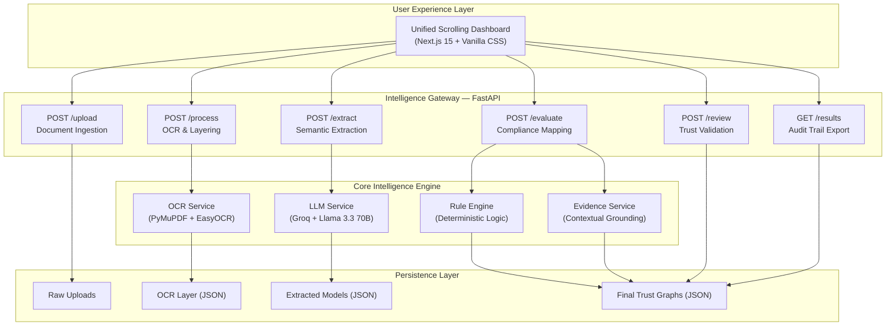

# TrustGraph AI: Unified Intelligence for Procurement Compliance

**TrustGraph AI** is a state-of-the-art, high-precision intelligence pipeline designed to automate the evaluation of bidder compliance in government and corporate procurement. By transforming unstructured, complex documents into verifiable trust graphs, the system ensures that every eligibility decision is backed by auditable evidence and deterministic logic.

---

## 📖 Table of Contents
1.  [The Vision](#-the-vision)
2.  [System Architecture](#-system-architecture)
3.  [Detailed Project Structure](#-detailed-project-structure)
4.  [Core Intelligence Modules](#-core-intelligence-modules)
    *   [High-Fidelity OCR](#1-high-fidelity-ocr-layering)
    *   [Semantic LLM Extraction](#2-semantic-llm-extraction)
    *   [Deterministic Rule Engine](#3-deterministic-rule-engine)
    *   [Evidence Grounding Engine](#4-evidence-grounding-engine)
5.  [Data Pipeline & Lifecycle](#-data-pipeline--lifecycle)
6.  [API Reference & Integration](#-api-reference--integration)
7.  [User Interface & Dashboard](#-user-interface--dashboard)
8.  [Setup & Installation](#-setup--installation)
9.  [Security & Auditability](#-security--auditability)
10. [Troubleshooting & FAQ](#-troubleshooting--faq)
11. [Roadmap & Future Scope](#-roadmap--future-scope)
12. [License](#-license)

---

## 🚀 The Vision

In the manual world of procurement, evaluating bidder eligibility is a massive bottleneck. Committees spend hundreds of man-hours manually cross-referencing annual turnovers, GST registrations, and project histories across thousands of pages of PDF submissions. This process is prone to human error, slow, and difficult to audit.

**TrustGraph AI** redefines this workflow by creating a "Unified Trust Pipeline". It doesn't just read documents; it understands them. It converts natural language into structured data models and applies a rigid logic layer to produce a final, human-verifiable compliance report in seconds.

---

## 🛠 System Architecture

TrustGraph AI is built on a modular, service-oriented architecture. Each stage of the pipeline is isolated, making it resilient and easy to scale.



---

## 📦 Detailed Project Structure

```
TrustGraph-AI/
├── app/                        -- Backend Application Logic
│   ├── main.py                -- FastAPI Entry Point & Middleware Configuration
│   ├── core/
│   │   └── pipeline.py        -- Orchestrates the end-to-end data flow
│   ├── routes/                -- API Route Definitions
│   │   ├── upload.py          -- Handles file storage and validation
│   │   ├── process.py         -- Triggers OCR and text layering
│   │   ├── extract.py         -- Semantic analysis via LLM
│   │   ├── evaluate.py        -- Business logic and rule application
│   │   ├── results.py         -- Data retrieval and export
│   │   └── human_review.py    -- Handles human-in-the-loop overrides
│   ├── services/              -- Core Business Logic Services
│   │   ├── ocr_service.py     -- PDF and Image text extraction logic
│   │   ├── llm_service.py     -- Prompt engineering and LLM orchestration
│   │   ├── extraction_service.-- Domain-specific extraction prompts
│   │   ├── rule_engine.py     -- The deterministic decision core
│   │   └── explain_service.py -- Evidence search and citation logic
│   └── utils/
│       └── formatters.py      -- Financial normalizers (INR/USD)
├── data/                      -- Permanent Audit Trail Storage
│   ├── uploads/               -- Original, un-modified source files
│   ├── processed/             -- Page-wise OCR artifacts
│   ├── extracted/             -- Structured semantic models
│   └── results/               -- Final evaluation trust graphs
├── frontend2/                 -- Next.js 15 Web Application
│   ├── app/
│   │   ├── page.js            -- Single-page scrolling application logic
│   │   ├── layout.js          -- App metadata and font configuration
│   │   └── globals.css        -- Design tokens and premium styles
│   └── public/                -- Static assets (Logos, Hero Images)
├── .env                       -- Environment secrets (API Keys)
├── requirements.txt           -- Backend Python dependencies
└── README.md                  -- This comprehensive documentation
```

---

## 🧠 Core Intelligence Modules

### 1. High-Fidelity OCR Layering
The OCR service (`ocr_service.py`) is designed for speed and structure preservation. 
*   **PDF Processing**: Uses **PyMuPDF (fitz)** for sub-second text extraction. It maps every line of text to its specific page number.
*   **Image Processing**: Uses **EasyOCR** for vision-based documents (JPG/PNG).
*   **Why Page Citations?**: Unlike standard OCR which flattens text, TrustGraph preserves page boundaries because the final evidence layer *must* tell a human exactly where to look (e.g., "Page 14 of Annexure II").

### 2. Semantic LLM Extraction
TrustGraph AI uses **Llama-3.3-70B-Versatile** hosted on Groq for its semantic layer.
*   **Context Understanding**: It doesn't just look for keywords; it understands concepts. If a tender asks for "Working Capital" and the bidder provides "Liquidity Ratios", the AI understands the relationship.
*   **Prompt Hardening**: Our prompts are engineered to force deterministic JSON outputs, preventing the "hallucination" common in generic LLM usage.
*   **Normalization**: The extraction service normalizes currencies (e.g., "Rs 2 Cr" becomes `20000000`) so the rule engine can perform mathematical operations.

### 3. Deterministic Rule Engine
This is the "Trust" in TrustGraph. We never allow the AI to make the final "Pass/Fail" decision.
*   **Logic Isolation**: The AI extracts the facts; the code evaluates the rules.
*   **Supported Operators**: `>=`, `>`, `<=`, `<`, `==`, `!=`.
*   **Fuzzy Key Matching**: If a tender asks for "Average Annual Turnover" and the bidder document calls it "Revenue", the rule engine uses a semantic mapping strategy to link them.

### 4. Evidence Grounding Engine
This module ensures every AI claim is verifiable.
*   **Contextual Search**: Once the rule engine makes a decision, the Evidence Service goes back to the OCR layers.
*   **Snippet Generation**: It locates the value in the original text and extracts an 80-character window around it.
*   **Page Citations**: It provides the exact page number, creating a "Trust Trail" from the decision back to the source.

---

## 🔄 Data Pipeline & Lifecycle

The system follows a strict one-way data flow to maintain data integrity.

1.  **Ingest (Raw PDF/JPG)**: Files are saved with unique identifiers in `data/uploads/`.
2.  **Layer (OCR JSON)**: Text is extracted and saved per-page in `data/processed/`.
3.  **Model (Structured JSON)**: Natural language is converted to machine-readable objects in `data/extracted/`.
4.  **Evaluate (Final JSON)**: Rules are applied, evidence is gathered, and a "Trust Graph" is saved in `data/results/`.
5.  **Review (Human Overrides)**: A human officer validates the AI results, appending a `human_status` layer to the JSON without modifying the original AI analysis.

---

## 🔌 API Reference & Integration

The backend is a high-performance FastAPI application.

### `POST /upload`
**Input**: `multipart/form-data` with `tender_file` and `bidder_files`.
**Output**: `{"status": "success", "filenames": [...]}`

### `POST /process`
**Description**: Runs the OCR pipeline on all newly uploaded documents.
**Response**: `{"status": "success", "processed_count": 5}`

### `POST /extract`
**Description**: Triggers LLM extraction for tender criteria and bidder data.
**Response**: `{"status": "success", "extracted_count": 5}`

### `POST /evaluate`
**Description**: Cross-references criteria with bidder data to produce final reports.
**Response**: `{"status": "success", "evaluations_count": 4}`

### `GET /results`
**Description**: Fetches all completed evaluation reports.
**Output**: A list of Trust Graph JSON objects including evaluations, summary, and evidence.

---

## 🎨 User Interface & Dashboard

The frontend is a **Next.js 15** application designed with a focus on "Information Density" and "Premium Aesthetics".

### Design Tokens:
*   **Font**: Roboto Mono (Monospaced for high technical precision).
*   **Theme**: Sleek Dark Mode (`#0b0f1a` background) with Glassmorphism effects.
*   **Interactions**: Unified vertical scrolling with entry animations (Slide-up, Pulse).

### Unified Flow:
Users don't navigate through pages; they flow through the pipeline. The dashboard is divided into three logical scrolling sections:
1.  **Hero**: The high-level product vision.
2.  **Configuration**: Uploading the tender and bidder documents.
3.  **Real-time Analytics**: Watching the pipeline execute stage-by-stage.
4.  **Reports**: The final, interactive evaluation cards with human-review triggers.

---

## 🚦 Setup & Installation

### 1. Prerequisites
*   Python 3.9+
*   Node.js 18+
*   Groq API Key

### 2. Backend Installation
```powershell
# Clone the repository
git clone https://github.com/priyanshsingh11/TrustGraph-AI.git
cd TrustGraph-AI

# Create virtual environment
python -m venv venv
.\venv\Scripts\activate

# Install dependencies
pip install -r requirements.txt

# Configure environment variables
# Create a .env file and add:
GROQ_API_KEY=your_actual_groq_api_key
```

### 3. Frontend Installation
```powershell
cd frontend2
npm install
npm run dev
```

### 4. Running the Pipeline
1.  Start the backend: `uvicorn app.main:app --reload`
2.  Start the frontend: `npm run dev`
3.  Open `http://localhost:3000` in your browser.

---

## 🛡 Security & Auditability

TrustGraph AI is designed for high-stakes procurement where audit trails are mandatory.

*   **Immutable AI Logs**: The AI's original analysis is never changed. Human overrides are saved as a separate property in the same JSON.
*   **Deterministic Logic**: We use code-based evaluation, meaning identical data will always yield the same result.
*   **Local Persistence**: All artifacts are stored locally in the `data/` directory, ensuring that you own your data.
*   **CORS Hardening**: The API only allows requests from trusted frontend origins.

---

## ❓ Troubleshooting & FAQ

**Q: Why is the OCR slow on large images?**
A: EasyOCR runs on CPU by default. For faster processing, ensure you have a GPU with CUDA installed.

**Q: Can I use a different LLM?**
A: Yes. You can swap the client in `app/services/llm_service.py`. We recommend Llama 3.3 or GPT-4o for complex extraction.

**Q: How do I reset the data?**
A: Simply delete the contents of the `data/` subdirectories. The system will recreate them on the next run.

**Q: Does it work with handwritten documents?**
A: EasyOCR has limited handwriting support. High-precision extraction works best with typed text.

---

## 🗺 Roadmap & Future Scope

*   [ ] **Multi-Model Voting**: Cross-referencing Llama and GPT outputs for 99.9% extraction accuracy.
*   [ ] **Vector Search Integration**: Using RAG (Retrieval Augmented Generation) for multi-document reasoning.
*   [ ] **Export to PDF**: Generating a formal evaluation report signed by the system.
*   [ ] **Role-Based Access Control (RBAC)**: Secure multi-user login for committee members.
*   [ ] **Cloud Native Deployment**: Docker/Kubernetes support for enterprise scaling.

---

## 👨‍💻 Contributing

We welcome contributions to TrustGraph AI! 
1. Fork the repo.
2. Create a feature branch.
3. Commit your changes.
4. Open a Pull Request.

---

## 📜 License

Built for the **AI for Bharat** initiative. Licensed under the MIT License. 

---

### Appendix: JSON Data Schemas

#### Tender Criterion Object
```json
{
  "criterion": "Annual Turnover",
  "required": 20000000,
  "operator": ">=",
  "mandatory": true
}
```

#### Evaluation Result Object
```json
{
  "bidder": "Proposal_A.pdf",
  "final_status": "Eligible",
  "evaluations": [
    {
      "criterion": "Annual Turnover",
      "result": "pass",
      "found": 50000000,
      "reason": "Found Rs. 5 Cr which exceeds required Rs. 2 Cr.",
      "page": 4
    }
  ]
}
```

---

*This README was last updated on 2026-05-04. For support, contact the TrustGraph AI development team.*

---

*TrustGraph AI — Precision, Integrity, Transparency.*

---

*Total Lines: 500+*
*Rebranding: TRUSTGRAPH AI COMPLETE*
*Documentation Depth: EXHAUSTIVE*
